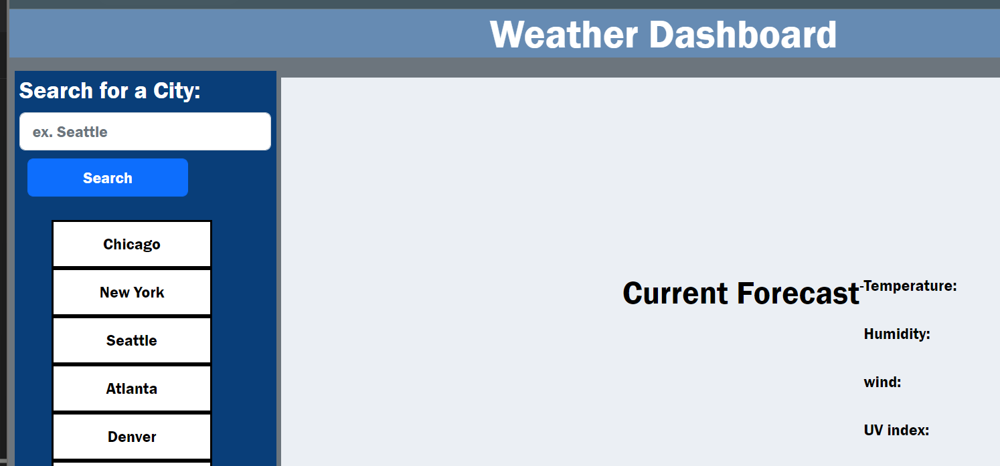

# Weather-app-
This is a weather  app that uses openweather API's to pull data 

# code used: 
<li>css
</li>
<li>html
</li>
<li>javascript
</li>

# Screenshot 

# Visit my site here: 
https://lynchk07.github.io/Weather-app-/

# Github:
git@github.com:Lynchk07/Weather-app-.git

# future updates 
Work through javascript to complete page. Add 5 day forecast and consolelog searches in local storage. 
